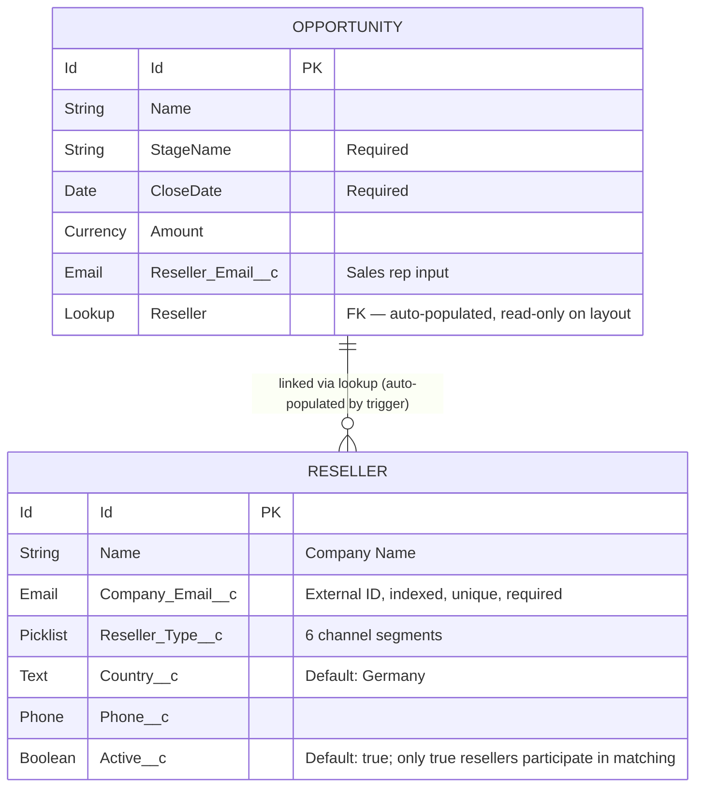

# VoltStream Mobility — Salesforce CRM

> A Salesforce DX portfolio project that models a B2B EV charging infrastructure supplier in Germany. Sales reps enter a single field on an Opportunity, an Apex trigger built on the **Kevin O'Hara `sfdc-trigger-framework`** auto-links the deal to the right channel partner, and reports surface revenue per reseller.

[](https://github.com/kevinohara80/sfdc-trigger-framework)
[]()
[]()
[]()

---

## Why this project

The German Salesforce market is hiring aggressively in **e-mobility and automotive** (EnBW mobility+, Ionity, Allego, Mercedes-Benz Mobility). This project demonstrates the exact skill mix those job posts ask for: a real custom-object + trigger + test + dashboard scenario, built with industry-standard patterns rather than the inline "logic-in-the-trigger" style typical of beginner work.

---

## Business scenario

VoltStream Mobility GmbH (fictional) is a B2B supplier of EV charging hardware and software. They sell **through a channel-partner network**, not direct to consumers:

| Reseller type | Example |
|---|---|
| Electrical Contractor | Berlin Elektrotechnik GmbH |
| Auto Dealer | Mercedes-Benz Berlin Mitte |
| Hotel Chain | Steigenberger Hotels |
| Mall | MediaMarkt Deutschland |
| Parking Operator | APCOA Parking Deutschland |
| Energy Company | Stadtwerke München |

**Pain point:** When a sales rep creates a new Opportunity, they need to attribute it to the reseller that sourced the deal. Manual lookup is slow and error-prone.

**Solution:** The rep types the reseller's company email into one field. An Apex trigger looks up the matching `Reseller__c` (case-insensitive, only active resellers) and auto-populates the Reseller lookup. Reports aggregate revenue per reseller so leadership can see which partners drive the channel.

---

## Data model



The relationship is **lookup**, not master-detail — Opportunities survive
deletion of their Reseller (the lookup goes null via `deleteConstraint=SetNull`)
because revenue data must outlive partner churn.

## Architecture

The project follows the **four-layer Kevin O'Hara enterprise pattern**: each class has exactly one responsibility, so the trigger file stays trivially small, the handler is a pure dispatcher, and the matching logic lives in a stateless helper that's testable in isolation.

```
┌─────────────────────────────────────────────────────────────────┐
│                     Opportunity (standard)                      │
│  ┌──────────────────────────┐    ┌──────────────────────────┐   │
│  │ Reseller_Email__c        │    │ Reseller__c (lookup)     │   │
│  │ (sales rep types email)  │    │ (auto-populated)         │   │
│  └────────────┬─────────────┘    └─────────▲────────────────┘   │
│               │                            │                    │
└───────────────┼────────────────────────────┼────────────────────┘
                │                            │
                │  insert / update           │  matched Id
                ▼                            │
┌─────────────────────────────────────────────────────────────────┐
│   OpportunityTrigger (3 lines — ROUTE)                          │
│      new OpportunityTriggerHandler().run();                     │
└────────────────────────────┬────────────────────────────────────┘
                             │ delegates
                             ▼
┌─────────────────────────────────────────────────────────────────┐
│   OpportunityTriggerHandler extends TriggerHandler (DISPATCH)   │
│   - beforeInsert()  ──► OpportunityTriggerHelper.assign...      │
│   - beforeUpdate()  ──► OpportunityTriggerHelper.assign...      │
│   No business logic here; only context-to-helper routing.       │
└────────────────────────────┬────────────────────────────────────┘
                             │ calls static methods
                             ▼
┌─────────────────────────────────────────────────────────────────┐
│   OpportunityTriggerHelper (LOGIC — stateless statics)          │
│   - assignResellerLookup(opps, oldMap):                         │
│       1. Collect non-null, lowercase emails                     │
│       2. Skip records whose email did not change (on update)    │
│       3. ONE bulkified SOQL: WHERE Active__c = true             │
│       4. Map<lowercase email, Reseller Id>                      │
│       5. Assign lookup; null if no match (silent fail)          │
└─────────────────────────────────────────────────────────────────┘

         (Handler also extends ↓ for context dispatch + bypass API)
┌─────────────────────────────────────────────────────────────────┐
│   TriggerHandler (Kevin O'Hara framework — verbatim)            │
│   - run() switches on Trigger context to call beforeInsert etc. │
│   - bypass() / clearBypass() for test setup and bulk loads      │
│   - setMaxLoopCount() for recursion protection                  │
└─────────────────────────────────────────────────────────────────┘
```

**Why four layers?** Each class has one job, so reviews are quick, tests can target a single layer, and adding a new context (e.g. `afterInsert` for an audit-log feature later) is a one-line override that points at a new Helper method — no risk of touching the matching algorithm.

The Helper runs **one bulkified SOQL** per batch (handles 200-record inserts within governor limits) and fails safely — if no reseller matches, the lookup stays null instead of blocking the save.

---

## What's in the project

### Custom object: `Reseller__c`

| Field | Type | Notes |
|---|---|---|
| `Name` | Text | Labelled "Company Name" |
| `Company_Email__c` | Email, required, unique | Matching key for the trigger |
| `Reseller_Type__c` | Picklist (6 values) | Drives report grouping |
| `Country__c` | Text, default "Germany" | |
| `Phone__c` | Phone | |
| `Active__c` | Checkbox, default true | Inactive resellers are excluded from matching |

### Opportunity custom fields

| Field | Type | Notes |
|---|---|---|
| `Reseller_Email__c` | Email | Sales rep input |
| `Reseller__c` | Lookup → `Reseller__c` | Read-only via permission set; trigger owns writes. Delete constraint = SetNull (Opportunity survives reseller deletion) |

### Apex

| Class | Layer | Purpose | Coverage |
|---|---|---|---|
| `TriggerHandler` | Framework | Kevin O'Hara base class (verbatim copy) | 100% |
| `TriggerHandler_Test` | Framework | Kevin O'Hara framework test class | — |
| `OpportunityTrigger` | Route | One-line trigger; delegates to handler | 100% |
| `OpportunityTriggerHandler` | Dispatch | Thin dispatcher; routes contexts to helper methods | 100% |
| `OpportunityTriggerHelper` | Logic | Stateless matching algorithm, bulkified, case-insensitive at the application layer | 100% |
| `ResellerSelector` | Data access | Selector pattern (FFLib-style) — single home for every Reseller__c SOQL query. Helper calls in here instead of inlining queries. | 100% |
| `StringUtils` | Utility | Centralized string normalization (email lowercasing, phone formatting, whitespace cleanup). Single source of truth — Helper delegates here. | 100% |
| `TestDataFactory` | Test utility | Centralized Reseller / Opportunity builder used by every test class. Schema changes update one factory method, never per-test boilerplate. | 100% |
| `OpportunityTriggerHandlerTest` | Integration tests | 10 methods — DML-based, prove the trigger fires end-to-end | — |
| `OpportunityTriggerHelperTest` | Unit tests | 8 methods — direct static-method calls, no Opportunity DML | — |
| `ResellerSelectorTest` | Unit tests | 5 methods — verifies query contracts (active filter, empty input, case-sensitive External ID lookup) | — |
| `StringUtilsTest` | Unit tests | 18 methods — every branch of every utility, including null-safe edge cases | — |
| `TestDataFactoryTest` | Unit tests | 4 methods — pins the documented defaults so other tests can rely on them | — |

### UI

- `Reseller` tab (Custom20: Plug motif, fits the EV theme)
- `Reseller Layout` page layout (two sections: Reseller Information + System Information)
- `Channel Partner` section added to the standard Opportunity Layout
- `All Resellers` and `Active Resellers` list views

### Permissions

- `VoltStream Reseller Access` permission set — grants CRUD on `Reseller__c`, FLS on every custom field, and read-only access to `Opportunity.Reseller__c` (the trigger owns it)

### Scripts

- `scripts/apex/seedData.apex` — idempotent demo data loader (6 resellers + 10 opportunities covering match / no-match / inactive / case-insensitive / direct-deal scenarios)

### Manifests

- `manifest/package.xml` and `manifest/destructiveChanges.xml` — preserved from the original org cleanup so the deployment is reproducible

---

## Repository structure

```
force-app/main/default/
├── classes/                  Apex classes + tests
│   ├── TriggerHandler.cls            (framework base)
│   ├── TriggerHandler_Test.cls       (framework tests)
│   ├── OpportunityTriggerHandler.cls (dispatcher)
│   ├── OpportunityTriggerHelper.cls  (matching algorithm)
│   ├── ResellerSelector.cls          (Reseller SOQL — Selector pattern)
│   ├── StringUtils.cls               (centralized string normalization)
│   ├── TestDataFactory.cls           (shared test record builder)
│   ├── OpportunityTriggerHandlerTest.cls  (integration tests)
│   ├── OpportunityTriggerHelperTest.cls   (unit tests)
│   ├── ResellerSelectorTest.cls           (unit tests)
│   ├── StringUtilsTest.cls                (unit tests)
│   └── TestDataFactoryTest.cls            (unit tests)
├── triggers/
│   └── OpportunityTrigger.trigger
├── objects/
│   ├── Reseller__c/          Custom object + fields + list views
│   └── Opportunity/fields/   Custom fields on the standard object
├── layouts/
│   ├── Reseller__c-Reseller Layout.layout-meta.xml
│   └── Opportunity-Opportunity Layout.layout-meta.xml
├── tabs/
│   └── Reseller__c.tab-meta.xml
└── permissionsets/
    └── VoltStream_Reseller_Access.permissionset-meta.xml

scripts/apex/seedData.apex    Idempotent demo data loader
manifest/                     package.xml + destructiveChanges.xml
```

---

## Setup

### Prerequisites

- [Salesforce CLI](https://developer.salesforce.com/tools/sfdxcli) (`sf` v2.x)
- A Developer Edition org or Trailhead Playground

### Step 1 — Authorize the target org

```bash
sf org login web --alias VoltStreamDev --set-default
```

### Step 2 — Deploy all metadata + run all tests

```bash
sf project deploy start --source-dir force-app --test-level RunLocalTests
```

Expected result: 15 components deployed, 24 tests passing, 100% coverage on custom Apex.

### Step 3 — Assign the permission set to your user

```bash
sf org assign permset --name VoltStream_Reseller_Access
```

This is required — without it, custom fields are invisible to the running user (Salesforce field-level security).

### Step 4 — Seed demo data

```bash
sf apex run --file scripts/apex/seedData.apex
```

Creates 6 resellers and 10 opportunities; the trigger fires automatically. The script is idempotent — safe to re-run any time.

### Step 5 — Open the org and explore

```bash
sf org open
```

Navigate: **App Launcher → Sales → Resellers** (switch the list view from "Recently Viewed" to "All Resellers"). Open any reseller to see its related Opportunities, populated by the trigger.

---

## Testing

Run the Apex test suite locally with code coverage:

```bash
sf apex run test --test-level RunLocalTests --code-coverage --result-format human --synchronous
```

Expected: **63 tests pass, 100% coverage on custom code, 0 failures.**

The suite is **layered**:

- **`OpportunityTriggerHelperTest`** — unit tests that call the Helper's static methods directly, without inserting any Opportunities. Fast, focused, and prove the matching algorithm is correct in isolation.
- **`OpportunityTriggerHandlerTest`** — integration tests that go through DML so the trigger actually fires. Prove the Trigger → Handler → Helper chain wires end-to-end in a real transaction.

`OpportunityTriggerHandlerTest` covers every branch of the matching logic:

- Email match (lowercase) → lookup populated
- Case-insensitive match (`PARTNER@X.DE` matches `partner@x.de`)
- Inactive reseller (`Active__c = false`) → no match
- Unknown email → silent null (never blocks save)
- Null email → skipped cleanly
- Bulk insert of 200 records → proves bulkification (would hit 100-SOQL governor limit if not bulkified)
- Update with changed email → re-matches
- Update with cleared email → lookup cleared
- Update with unchanged email → lookup preserved
- `TriggerHandler.bypass('OpportunityTriggerHandler')` → trigger skipped (proves the framework's bypass API is wired up)

---

## Design decisions

A few non-obvious choices, called out so reviewers don't have to guess:

- **Kevin O'Hara framework is non-negotiable, AND we apply the full four-layer separation.** Every trigger goes through `TriggerHandler.run()`. The Trigger only routes; the Handler only dispatches contexts; the Helper only holds business logic. This is the de-facto enterprise pattern — copying it ships recursion control, bypass API, and max-loop protection for free, and the Helper layer keeps the matching algorithm unit-testable without DML.
- **Lookup is read-only on the layout** — even though Salesforce permits manual editing, the permission set restricts `Opportunity.Reseller__c` to read-only. The trigger is the single source of truth; allowing manual edits would mislead users.
- **Inactive resellers are excluded at SOQL level**, not in post-query Apex. Cheaper and explicit.
- **No-match is silent.** A missing reseller must never block an Opportunity from saving — channel attribution is a nice-to-have, not a gating field.
- **Update path is optimised.** On update, the trigger only re-queries when `Reseller_Email__c` actually changed (using `Trigger.oldMap`), so editing unrelated fields adds zero SOQL.
- **Tier picklist (Bronze/Silver/Gold/Platinum) is intentionally deferred** to a future phase to keep the first iteration focused on the matching mechanic.
- **Every Apex class ships with its own `*Test.cls`.** No untested classes land on `main`. Helpers get unit tests (no DML); Triggers and Handlers get integration tests (via DML).
- **String normalization is centralized in `StringUtils`.** Email lowercasing, phone formatting, whitespace cleanup — none are inlined anywhere. When the rule changes, it changes in one place. Null-safe contract: blank in -> null out, never throws.
- **All Reseller SOQL goes through `ResellerSelector` (Selector pattern).** Helpers and Handlers don't write inline SOQL. When a query needs new fields, an index hint, or a different WHERE clause, exactly one file changes. FFLib Apex Common's de-facto enterprise convention.
- **`Reseller__c.Company_Email__c` is marked External ID** for indexed lookups. Trade-off: SOQL `IN` against External ID is case-sensitive at the storage layer. The Helper compensates by always normalizing with `StringUtils.normalizeEmail()` before passing emails to the Selector, and seed data is inserted lowercase. A future ResellerTrigger will normalize manually-entered values too — see Roadmap.
- **Test data is built via `TestDataFactory`.** No test class re-implements the Reseller / Opportunity constructor pattern. Schema changes propagate through one file.

---

## Roadmap

Planned next phases (not built yet):

- **Reseller Tier picklist** + commission rate per tier + rollup of YTD commission
- **Reports**: Opportunities per Reseller, Pipeline by Reseller Type, Commission Forecast
- **Dashboard** combining the above with bar / pie / KPI tiles
- **Notification on new match**: post a Chatter message to the reseller's Chatter feed when a new Opportunity is auto-linked
- **Lightning Web Component**: "My Channel Pipeline" tile for the rep home page
- **CI**: GitHub Actions workflow that deploys to a scratch org and runs the test suite on every PR

---

## Credits

- Trigger framework: [`kevinohara80/sfdc-trigger-framework`](https://github.com/kevinohara80/sfdc-trigger-framework) (MIT licensed). `TriggerHandler.cls` and `TriggerHandler_Test.cls` are copied verbatim from that repo.
- Built and documented as a Salesforce portfolio project for the **German job market**, focused on the e-mobility / automotive domain.
