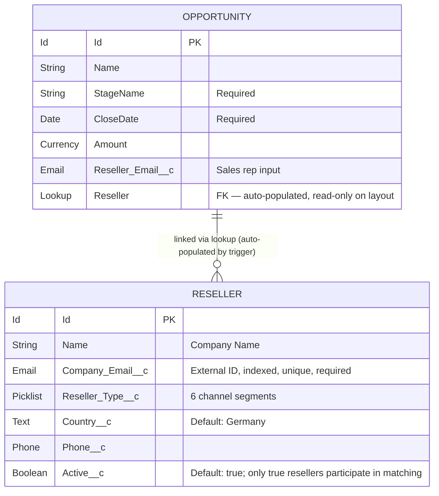

# VoltStream Mobility — Salesforce CRM

> A Salesforce DX portfolio project that models a B2B EV charging infrastructure supplier in Germany. Sales reps enter a single field on an Opportunity, an Apex trigger built on the **Kevin O'Hara `sfdc-trigger-framework`** auto-links the deal to the right channel partner, and reports surface revenue per reseller. Two later phases add a **Document Manager LWC** (folder cards, real file upload, preview, share-to-Chatter) and a **bulkified Task-count rollup** onto Opportunity that replaces a DLRS package.

[](https://github.com/kevinohara80/sfdc-trigger-framework)
[]()
[]()
[]()

---

## Why this project

The German Salesforce market is hiring aggressively in **e-mobility and automotive** (EnBW mobility+, Ionity, Allego, Mercedes-Benz Mobility). This project demonstrates the exact skill mix those job posts ask for: a real custom-object + trigger + test + dashboard scenario, built with industry-standard patterns rather than the inline "logic-in-the-trigger" style typical of beginner work.

---

## Business scenario

VoltStream Mobility GmbH (fictional) is a B2B supplier of EV charging hardware and software. They sell **through a channel-partner network**, not direct to consumers:

| Reseller type | Example |
|---|---|
| Electrical Contractor | Berlin Elektrotechnik GmbH |
| Auto Dealer | Mercedes-Benz Berlin Mitte |
| Hotel Chain | Steigenberger Hotels |
| Mall | MediaMarkt Deutschland |
| Parking Operator | APCOA Parking Deutschland |
| Energy Company | Stadtwerke München |

**Pain point:** When a sales rep creates a new Opportunity, they need to attribute it to the reseller that sourced the deal. Manual lookup is slow and error-prone.

**Solution:** The rep types the reseller's company email into one field. An Apex trigger looks up the matching `Reseller__c` (case-insensitive, only active resellers) and auto-populates the Reseller lookup. Reports aggregate revenue per reseller so leadership can see which partners drive the channel.

---

## Demo

> Screenshots pending — [`docs/screenshots/`](docs/screenshots/) is empty for now.
> Planned captures: Resellers tab and list view, Opportunity edit form with the
> Channel Partner section and the auto-populated lookup, the Documents LWC, and
> the Apex test run (108 methods, 100% coverage on custom Apex at last org run).

The fastest way to reproduce the demo end to end:

```bash
sf project deploy start --source-dir force-app --test-level RunLocalTests
sf org assign permset --name VoltStream_Reseller_Access
sf apex run --file scripts/apex/seedData.apex
sf org open
```

Then open Sales > Resellers > "All Resellers" and any seeded Opportunity to
see the auto-linked Reseller. The Documents tab hosts the Document Manager
LWC (seeded with demo documents by the same script), and creating or
completing a Task on any Opportunity updates its Score / Completed Tasks
counts via the rollup trigger.

## Data model


```mermaid
erDiagram
    OPPORTUNITY ||--o{ RESELLER : "linked via lookup (auto-populated by trigger)"

    OPPORTUNITY {
        Id Id PK
        String Name
        String StageName "Required"
        Date CloseDate "Required"
        Currency Amount
        Email Reseller_Email__c "Sales rep input"
        Lookup Reseller "FK — auto-populated, read-only on layout"
    }

    RESELLER {
        Id Id PK
        String Name "Company Name"
        Email Company_Email__c "External ID, indexed, unique, required"
        Picklist Reseller_Type__c "6 channel segments"
        Text Country__c "Default: Germany"
        Phone Phone__c
        Boolean Active__c "Default: true; only true resellers participate in matching"
    }
```

The relationship is **lookup**, not master-detail — Opportunities survive
deletion of their Reseller (the lookup goes null via `deleteConstraint=SetNull`)
because revenue data must outlive partner churn.

## Architecture

The project follows the **four-layer Kevin O'Hara enterprise pattern**: each class has exactly one responsibility, so the trigger file stays trivially small, the handler is a pure dispatcher, and the matching logic lives in a stateless helper that's testable in isolation.

```
┌─────────────────────────────────────────────────────────────────┐
│                     Opportunity (standard)                      │
│  ┌──────────────────────────┐    ┌──────────────────────────┐   │
│  │ Reseller_Email__c        │    │ Reseller__c (lookup)     │   │
│  │ (sales rep types email)  │    │ (auto-populated)         │   │
│  └────────────┬─────────────┘    └─────────▲────────────────┘   │
│               │                            │                    │
└───────────────┼────────────────────────────┼────────────────────┘
                │                            │
                │  insert / update           │  matched Id
                ▼                            │
┌─────────────────────────────────────────────────────────────────┐
│   OpportunityTrigger (3 lines — ROUTE)                          │
│      new OpportunityTriggerHandler().run();                     │
└────────────────────────────┬────────────────────────────────────┘
                             │ delegates
                             ▼
┌─────────────────────────────────────────────────────────────────┐
│   OpportunityTriggerHandler extends TriggerHandler (DISPATCH)   │
│   - beforeInsert()  ──► OpportunityTriggerHelper.assign...      │
│   - beforeUpdate()  ──► OpportunityTriggerHelper.assign...      │
│   No business logic here; only context-to-helper routing.       │
└────────────────────────────┬────────────────────────────────────┘
                             │ calls static methods
                             ▼
┌─────────────────────────────────────────────────────────────────┐
│   OpportunityTriggerHelper (LOGIC — stateless statics)          │
│   - assignResellerLookup(opps, oldMap):                         │
│       1. Collect non-null, lowercase emails                     │
│       2. Skip records whose email did not change (on update)    │
│       3. ONE bulkified SOQL: WHERE Active__c = true             │
│       4. Map<lowercase email, Reseller Id>                      │
│       5. Assign lookup; null if no match (silent fail)          │
└─────────────────────────────────────────────────────────────────┘

         (Handler also extends ↓ for context dispatch + bypass API)
┌─────────────────────────────────────────────────────────────────┐
│   TriggerHandler (Kevin O'Hara framework — verbatim)            │
│   - run() switches on Trigger context to call beforeInsert etc. │
│   - bypass() / clearBypass() for test setup and bulk loads      │
│   - setMaxLoopCount() for recursion protection                  │
└─────────────────────────────────────────────────────────────────┘
```

**Why four layers?** Each class has one job, so reviews are quick, tests can target a single layer, and adding a new context (e.g. `afterInsert` for an audit-log feature later) is a one-line override that points at a new Helper method — no risk of touching the matching algorithm.

The Helper runs **one bulkified SOQL** per batch (handles 200-record inserts within governor limits) and fails safely — if no reseller matches, the lookup stays null instead of blocking the save.

---

## What's in the project

### Custom object: `Reseller__c`

| Field | Type | Notes |
|---|---|---|
| `Name` | Text | Labelled "Company Name" |
| `Company_Email__c` | Email, required, unique | Matching key for the trigger |
| `Reseller_Type__c` | Picklist (6 values) | Drives report grouping |
| `Country__c` | Text, default "Germany" | |
| `Phone__c` | Phone | |
| `Active__c` | Checkbox, default true | Inactive resellers are excluded from matching |

### Opportunity custom fields

| Field | Type | Notes |
|---|---|---|
| `Reseller_Email__c` | Email | Sales rep input |
| `Reseller__c` | Lookup → `Reseller__c` | Read-only via permission set; trigger owns writes. Delete constraint = SetNull (Opportunity survives reseller deletion) |
| `Score__c` | Number | Total related Tasks (every status). Maintained by the Task rollup trigger (Phase 3); not user-editable |
| `completed_task__c` | Number | Related Tasks with Status = Completed. Same rollup, same ownership |

### Phase 2 — Document Manager (`Document__c` + `documentManager` LWC)

- **`Document__c`** custom object with Chatter feeds enabled: `Category__c` (restricted picklist — Application Forms / Statements / Reports / Uncategorized), `File_Type__c` (text badge, e.g. PDF), `File_Size_KB__c` (integer). `All Documents` list view and a `Documents` tab.
- **`documentManager` LWC** — folder cards (one per `Category__c` picklist value, read live via `getPicklistValues`; each canonical category has its own inline-SVG colour), a searchable and sortable documents table (Date / Name / Size), real file upload into `ContentVersion` with a hand-built `ContentDocumentLink` back to the `Document__c`, file preview via `standard__namedPage` `filePreview`, download, delete, share-to-Chatter (a `ContentPost` with the file attached, then auto-navigate to the record), and a live Recent Activity strip.
- **`DocumentController`** (thin `@AuraEnabled` facade) + **`DocumentSelector`** (every `Document__c` / `ContentVersion` / `ContentDocumentLink` query, `WITH USER_MODE`).

### Phase 3 — Task rollup onto Opportunity (replaces DLRS)

- `TaskTrigger` → `TaskTriggerHandler` → `TaskTriggerHelper` → `TaskSelector` recompute `Opportunity.Score__c` (total Tasks) and `Opportunity.completed_task__c` (Completed Tasks) on after insert / update / delete / undelete — **one aggregate SOQL + one DML update** for any number of Tasks, where the DLRS package queried per record.
- `TaskSelector` and `TaskTriggerHelper` are **deliberately `without sharing`** and the aggregate query omits `WITH USER_MODE`: a rollup must count every child Task regardless of the running user's visibility, and must be able to write the system-owned counts onto a parent the Task-editing user may not be allowed to edit — exactly what DLRS did in system context. The justification lives in each class header.

### Apex

| Class | Layer | Purpose | Coverage |
|---|---|---|---|
| `TriggerHandler` | Framework | Kevin O'Hara base class (verbatim copy) | 100% |
| `TriggerHandler_Test` | Framework | Kevin O'Hara framework test class — 13 methods | — |
| `OpportunityTrigger` | Route | One-line trigger; delegates to handler | 100% |
| `OpportunityTriggerHandler` | Dispatch | Thin dispatcher; routes contexts to helper methods | 100% |
| `OpportunityTriggerHelper` | Logic | Stateless matching algorithm, bulkified, case-insensitive at the application layer | 100% |
| `ResellerTrigger` | Route | One-line trigger; delegates to ResellerTriggerHandler | 100% |
| `ResellerTriggerHandler` | Dispatch | Thin dispatcher — beforeInsert and beforeUpdate route to the Helper | 100% |
| `ResellerTriggerHelper` | Logic | Boundary-level normalization: every Reseller field passes through StringUtils on save (closes the External ID case-sensitivity loophole at the source) | 100% |
| `ResellerSelector` | Data access | Selector pattern (FFLib-style) — single home for every Reseller__c SOQL query. Helper calls in here instead of inlining queries. | 100% |
| `StringUtils` | Utility | Centralized string normalization (email lowercasing, phone formatting, whitespace cleanup). Single source of truth — Helper delegates here. | 100% |
| `TestDataFactory` | Test utility | Centralized Reseller / Opportunity / Task builder used by every test class. Schema changes update one factory method, never per-test boilerplate. | 100% |
| `DocumentController` | LWC controller | Thin `@AuraEnabled` facade for the documentManager LWC: documents per folder, category counts, upload (Document__c + ContentVersion + ContentDocumentLink), recent activity, share-to-Chatter | 100% |
| `DocumentSelector` | Data access | Every Document__c / ContentVersion / ContentDocumentLink query, `WITH USER_MODE`, bounded by LIMIT | 100% |
| `TaskTrigger` | Route | One-line trigger; after insert / update / delete / undelete → TaskTriggerHandler | 100% |
| `TaskTriggerHandler` | Dispatch | Routes each after-context to the rollup; update re-rolls both old and new parent | 100% |
| `TaskTriggerHelper` | Logic | Collects Opportunity parents out of polymorphic WhatId, folds the aggregate into Score / Completed counts, one update. `without sharing` by design | 100% |
| `TaskSelector` | Data access | One GROUP BY aggregate over Task per batch. `without sharing` by design | 100% |
| `OpportunityTriggerHandlerTest` | Integration tests | 10 methods — DML-based, prove the trigger fires end-to-end | — |
| `OpportunityTriggerHelperTest` | Unit tests | 8 methods — direct static-method calls, no Opportunity DML | — |
| `ResellerTriggerHandlerTest` | Integration tests | 7 methods — DML-based, including end-to-end Selector match proof | — |
| `ResellerTriggerHelperTest` | Unit tests | 10 methods — direct static-method calls, no Reseller DML | — |
| `ResellerSelectorTest` | Unit tests | 5 methods — verifies query contracts (active filter, empty input, case-sensitive External ID lookup) | — |
| `StringUtilsTest` | Unit tests | 20 methods — every branch of every utility, including null-safe edge cases | — |
| `TestDataFactoryTest` | Unit tests | 7 methods — pins the documented defaults (Reseller, Opportunity, Task builders) so other tests can rely on them | — |
| `DocumentControllerTest` | Integration tests | 9 methods — facade contracts, upload with/without content, Chatter share (TextPost / ContentPost / blank-message guard) | — |
| `DocumentSelectorTest` | Unit tests | 7 methods — category filter, null/blank/unknown category, recent activity ordering, zero-default counts, ContentDocument resolution | — |
| `TaskTriggerHandlerTest` | Integration tests | 9 methods — DML-based rollup through insert / status change / re-parent / delete / undelete / bulk | — |
| `TaskTriggerHelperTest` | Unit tests | 3 methods — WhatId collection (null, non-Opportunity parent) and empty-set no-op | — |

### UI

- `Reseller` tab (Custom20: Plug motif, fits the EV theme)
- `Reseller Layout` page layout (two sections: Reseller Information + System Information)
- `Channel Partner` section added to the standard Opportunity Layout
- `All Resellers` and `Active Resellers` list views
- `Documents` tab + `All Documents` list view, and the `documentManager` LWC (exposed for App, Home, Record pages and as a Tab)

### Permissions

- `VoltStream Reseller Access` permission set — grants CRUD on `Reseller__c` and `Document__c`, FLS on every custom field, the Reseller / Documents tabs, and read-only access to `Opportunity.Reseller__c` (the trigger owns it)
- `VoltStream Channel Manager` permission set group — bundles the permission set(s) a channel manager needs, so admins assign one group instead of individual sets

### Scripts

- `scripts/apex/seedData.apex` — idempotent demo data loader (6 resellers + 10 opportunities covering match / no-match / inactive / case-insensitive / direct-deal scenarios, plus demo `Document__c` rows for the LWC)

### Manifests

- `manifest/package.xml` and `manifest/destructiveChanges.xml` — preserved from the original org cleanup so the deployment is reproducible

---

## Repository structure

```
force-app/main/default/
├── classes/                  Apex classes + tests
│   ├── TriggerHandler.cls            (framework base)
│   ├── TriggerHandler_Test.cls       (framework tests)
│   ├── OpportunityTriggerHandler.cls (dispatcher)
│   ├── OpportunityTriggerHelper.cls  (matching algorithm)
│   ├── ResellerTriggerHandler.cls    (dispatcher)
│   ├── ResellerTriggerHelper.cls     (boundary-level normalization)
│   ├── ResellerSelector.cls          (Reseller SOQL — Selector pattern)
│   ├── StringUtils.cls               (centralized string normalization)
│   ├── DocumentController.cls        (LWC @AuraEnabled facade)
│   ├── DocumentSelector.cls          (Document / ContentVersion SOQL)
│   ├── TaskTriggerHandler.cls        (dispatcher — after contexts)
│   ├── TaskTriggerHelper.cls         (Task -> Opportunity rollup; without sharing)
│   ├── TaskSelector.cls              (Task aggregate SOQL; without sharing)
│   ├── TestDataFactory.cls           (shared test record builder)
│   ├── OpportunityTriggerHandlerTest.cls  (integration tests)
│   ├── OpportunityTriggerHelperTest.cls   (unit tests)
│   ├── ResellerTriggerHandlerTest.cls     (integration tests)
│   ├── ResellerTriggerHelperTest.cls      (unit tests)
│   ├── ResellerSelectorTest.cls           (unit tests)
│   ├── StringUtilsTest.cls                (unit tests)
│   ├── DocumentControllerTest.cls         (integration tests)
│   ├── DocumentSelectorTest.cls           (unit tests)
│   ├── TaskTriggerHandlerTest.cls         (integration tests)
│   ├── TaskTriggerHelperTest.cls          (unit tests)
│   └── TestDataFactoryTest.cls            (unit tests)
├── triggers/
│   ├── OpportunityTrigger.trigger    (route to OpportunityTriggerHandler)
│   ├── ResellerTrigger.trigger       (route to ResellerTriggerHandler)
│   └── TaskTrigger.trigger           (route to TaskTriggerHandler)
├── lwc/
│   └── documentManager/      Document Manager LWC (html, js, css, meta)
├── objects/
│   ├── Reseller__c/          Custom object + fields + list views
│   ├── Document__c/          Custom object + fields + list view (Chatter feeds on)
│   └── Opportunity/fields/   Reseller_Email__c, Reseller__c, Score__c, completed_task__c
├── layouts/
│   ├── Reseller__c-Reseller Layout.layout-meta.xml
│   └── Opportunity-Opportunity Layout.layout-meta.xml
├── tabs/
│   ├── Reseller__c.tab-meta.xml
│   └── Document__c.tab-meta.xml
├── permissionsets/
│   └── VoltStream_Reseller_Access.permissionset-meta.xml
└── permissionsetgroups/
    └── VoltStream_Channel_Manager.permissionsetgroup-meta.xml

scripts/apex/seedData.apex    Idempotent demo data loader
manifest/                     package.xml + destructiveChanges.xml
```

---

## Setup

### Prerequisites

- [Salesforce CLI](https://developer.salesforce.com/tools/sfdxcli) (`sf` v2.x)
- A Developer Edition org or Trailhead Playground

### Step 1 — Authorize the target org

```bash
sf org login web --alias VoltStreamDev --set-default
```

### Step 2 — Deploy all metadata + run all tests

```bash
sf project deploy start --source-dir force-app --test-level RunLocalTests
```

Expected result: all components deployed, 108 tests passing, 100% coverage on custom Apex at last org run.

### Step 3 — Assign the permission set to your user

```bash
sf org assign permset --name VoltStream_Reseller_Access
```

This is required — without it, custom fields are invisible to the running user (Salesforce field-level security).

### Step 4 — Seed demo data

```bash
sf apex run --file scripts/apex/seedData.apex
```

Creates 6 resellers and 10 opportunities; the trigger fires automatically. The script is idempotent — safe to re-run any time.

### Step 5 — Open the org and explore

```bash
sf org open
```

Navigate: **App Launcher → Sales → Resellers** (switch the list view from "Recently Viewed" to "All Resellers"). Open any reseller to see its related Opportunities, populated by the trigger.

### Validation deploy (recommended before merging changes)

Run a dry-run deploy that runs all tests but doesn't actually commit any
changes to the org. Use this on every feature branch before merging:

```bash
sf project deploy validate --source-dir force-app --test-level RunLocalTests
```

The `validate` flag wraps the deployment and tests in a transaction that is
rolled back when the validation finishes — your org is unchanged regardless
of the result. If validation succeeds, the same deploy run can be promoted
to a real deploy via `sf project deploy quick --job-id <validateJobId>`,
without re-running tests, in production change-set workflows.

---

## Testing

Run the Apex test suite locally with code coverage:

```bash
sf apex run test --test-level RunLocalTests --code-coverage --result-format human --synchronous
```

Expected: **108 tests pass, 100% coverage on custom Apex at last org run, 0 failures.**

Test methods per class (counted from the `@IsTest` methods in the source):

| Test class | Methods |
|---|---|
| `StringUtilsTest` | 20 |
| `TriggerHandler_Test` (vendored) | 13 |
| `OpportunityTriggerHandlerTest` | 10 |
| `ResellerTriggerHelperTest` | 10 |
| `DocumentControllerTest` | 9 |
| `TaskTriggerHandlerTest` | 9 |
| `OpportunityTriggerHelperTest` | 8 |
| `DocumentSelectorTest` | 7 |
| `ResellerTriggerHandlerTest` | 7 |
| `TestDataFactoryTest` | 7 |
| `ResellerSelectorTest` | 5 |
| `TaskTriggerHelperTest` | 3 |
| **Total** | **108** |

The suite is **layered**:

- **`OpportunityTriggerHelperTest`** — unit tests that call the Helper's static methods directly, without inserting any Opportunities. Fast, focused, and prove the matching algorithm is correct in isolation.
- **`OpportunityTriggerHandlerTest`** — integration tests that go through DML so the trigger actually fires. Prove the Trigger → Handler → Helper chain wires end-to-end in a real transaction.
- The same split applies to the Reseller and Task trigger families, and to the Document Manager (`DocumentSelectorTest` exercises query contracts; `DocumentControllerTest` goes through the facade with real ContentVersion / FeedItem DML).

`OpportunityTriggerHandlerTest` covers every branch of the matching logic:

- Email match (lowercase) → lookup populated
- Case-insensitive match (`PARTNER@X.DE` matches `partner@x.de`)
- Inactive reseller (`Active__c = false`) → no match
- Unknown email → silent null (never blocks save)
- Null email → skipped cleanly
- Bulk insert of 200 records → proves bulkification (would hit 100-SOQL governor limit if not bulkified)
- Update with changed email → re-matches
- Update with cleared email → lookup cleared
- Update with unchanged email → lookup preserved
- `TriggerHandler.bypass('OpportunityTriggerHandler')` → trigger skipped (proves the framework's bypass API is wired up)

---

## Design decisions

A few non-obvious choices, called out so reviewers don't have to guess:

- **Kevin O'Hara framework is non-negotiable, AND we apply the full four-layer separation.** Every trigger goes through `TriggerHandler.run()`. The Trigger only routes; the Handler only dispatches contexts; the Helper only holds business logic. This is the de-facto enterprise pattern — copying it ships recursion control, bypass API, and max-loop protection for free, and the Helper layer keeps the matching algorithm unit-testable without DML.
- **Lookup is read-only on the layout** — even though Salesforce permits manual editing, the permission set restricts `Opportunity.Reseller__c` to read-only. The trigger is the single source of truth; allowing manual edits would mislead users.
- **Inactive resellers are excluded at SOQL level**, not in post-query Apex. Cheaper and explicit.
- **No-match is silent.** A missing reseller must never block an Opportunity from saving — channel attribution is a nice-to-have, not a gating field.
- **Update path is optimised.** On update, the trigger only re-queries when `Reseller_Email__c` actually changed (using `Trigger.oldMap`), so editing unrelated fields adds zero SOQL.
- **Tier picklist (Bronze/Silver/Gold/Platinum) is intentionally deferred** to a future phase to keep the first iteration focused on the matching mechanic.
- **Every Apex class ships with its own `*Test.cls`.** No untested classes land on `main`. Helpers get unit tests (no DML); Triggers and Handlers get integration tests (via DML).
- **String normalization is centralized in `StringUtils`.** Email lowercasing, phone formatting, whitespace cleanup — none are inlined anywhere. When the rule changes, it changes in one place. Null-safe contract: blank in -> null out, never throws.
- **All Reseller SOQL goes through `ResellerSelector` (Selector pattern).** Helpers and Handlers don't write inline SOQL. When a query needs new fields, an index hint, or a different WHERE clause, exactly one file changes. FFLib Apex Common's de-facto enterprise convention.
- **`Reseller__c.Company_Email__c` is marked External ID** for indexed lookups. SOQL `IN` against External ID is case-sensitive at the storage layer, but every save path through Salesforce passes through `ResellerTrigger -> Handler -> Helper -> StringUtils.normalizeEmail()` so stored values are guaranteed lowercase. There is no save path that bypasses normalization (UI form, API insert, Data Loader, scratch-org seed — all go through the trigger).
- **Boundary-level normalization on Reseller__c.** `ResellerTriggerHelper.normalizeFields()` runs on every insert and update, lowercasing emails, formatting phones to `(NNN) NNN NN-NN`, and trimming whitespace from name and country. Mirrors the OpportunityTrigger family structurally — both objects with trigger logic share the same Trigger -> Handler -> Helper layout.
- **Test data is built via `TestDataFactory`.** No test class re-implements the Reseller / Opportunity / Task constructor pattern. Schema changes propagate through one file.
- **The Task rollup is the one deliberate `without sharing` exception.** Every other class that touches data is `with sharing` and queries `WITH USER_MODE`; `TaskSelector` and `TaskTriggerHelper` are not, because a rollup that only counted the Tasks the current user can see would write wrong numbers onto the Opportunity. The reasoning is in each class header so the exception cannot be mistaken for an oversight.

---

## Roadmap

Shipped:

- **Phase 1 — Channel Partner auto-linking** (Reseller__c, Opportunity trigger family, Selector, StringUtils, permission set, seed script)
- **Phase 2 — Document Manager LWC** (`Document__c`, `documentManager`, `DocumentController` + `DocumentSelector`)
- **Phase 3 — Task rollup onto Opportunity** (`TaskTrigger` family + `TaskSelector`, replaces DLRS)

Planned next phases (not built yet):

- **Reseller Tier picklist** + commission rate per tier + rollup of YTD commission
- **Reports**: Opportunities per Reseller, Pipeline by Reseller Type, Commission Forecast
- **Dashboard** combining the above with bar / pie / KPI tiles
- **Notification on new match**: post a Chatter message to the reseller's Chatter feed when a new Opportunity is auto-linked
- **Second LWC**: "My Channel Pipeline" tile for the rep home page (the Document Manager LWC already ships — see Phase 2)
- **Async Apex** (Batch / Queueable): nightly reseller sync from an external partner master

---

## Credits

- Trigger framework: [`kevinohara80/sfdc-trigger-framework`](https://github.com/kevinohara80/sfdc-trigger-framework) (MIT licensed). `TriggerHandler.cls` and `TriggerHandler_Test.cls` are copied verbatim from that repo.
- Built and documented as a Salesforce portfolio project for the **German job market**, focused on the e-mobility / automotive domain.
