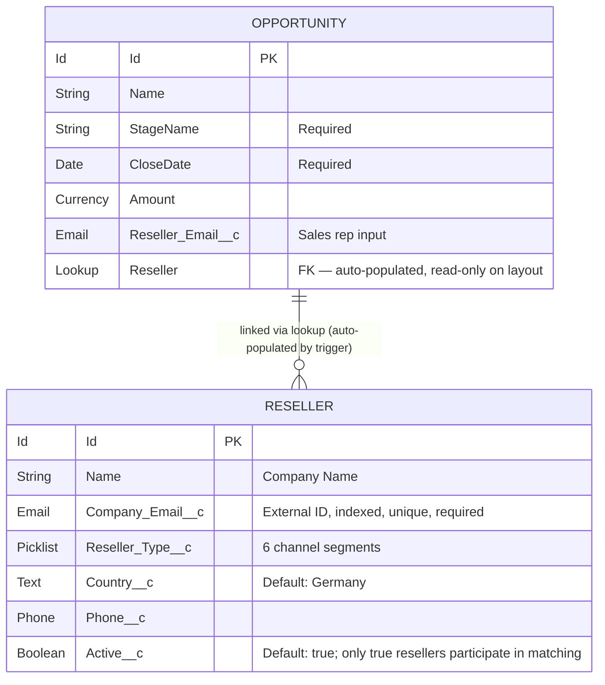
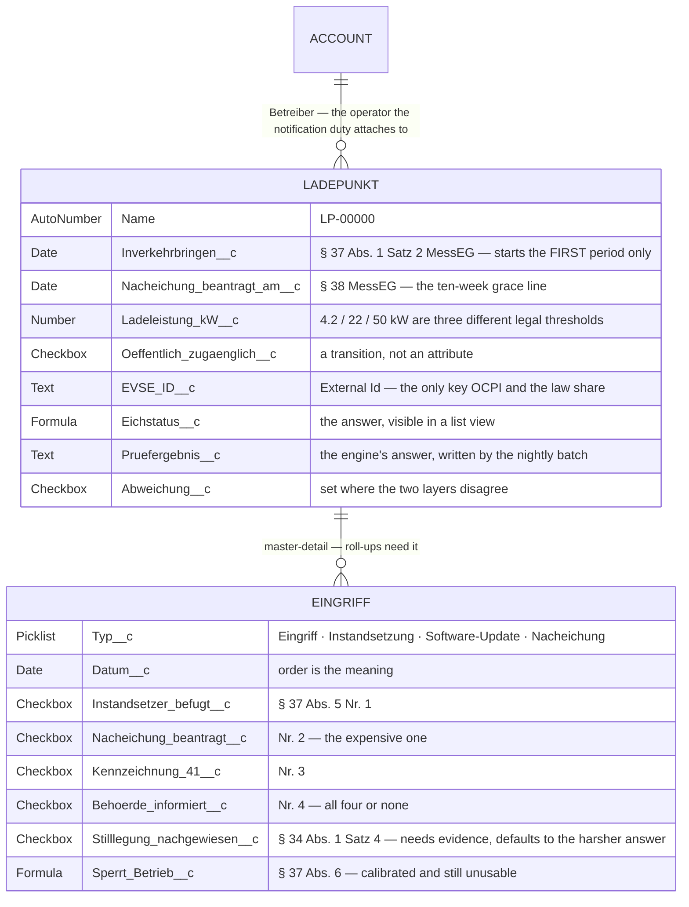

# VoltStream Mobility — Salesforce CRM

> A Salesforce DX portfolio project modelling a B2B EV charging supplier in Germany. It began as a
> channel-partner CRM — one field on an Opportunity, an Apex trigger on the **Kevin O'Hara
> `sfdc-trigger-framework`** auto-linking the deal to the right reseller — and grew into something
> with a sharper point: **a German charging-law compliance engine, with an Agentforce agent as its
> interface and a deterministic gate that stops the agent inventing law.**
>
> The charge points are **real and pulled live**: twenty-five in central Berlin, operated by
> Allego, Vattenfall, Shell Recharge, Berliner Stadtwerke and E.ON among others, fetched from the
> public map with no API key. A nightly batch evaluates the fleet against **MessEG** and **MessEV**,
> and the legal status of every charge point is a column you can sort a list view by.
>
> **Every one of the twenty-five comes back `UNBEKANNT`** — because no public charge point database
> carries what German calibration law requires, and a missing date is not a clean bill of health.

[](https://github.com/kevinohara80/sfdc-trigger-framework)
[]()
[]()
[]()
[]()
[]()
[]()

---

## Why this project

The German Salesforce market is hiring in **e-mobility and automotive** (EnBW mobility+, Ionity,
Allego, Mercedes-Benz Mobility). The first phases demonstrate the skill mix those posts ask for: a
real custom-object + trigger + test scenario built with industry-standard patterns rather than the
inline "logic-in-the-trigger" style typical of beginner work.

The later phase answers a harder question. Anyone can wire an LLM to a CRM. **The problem is that a
model asked about German metrology law will answer fluently and sometimes wrongly, in a language
the reviewer may not read.** That is not a prompt-engineering problem; it is an architecture
problem, and this repository is one answer to it.

---

## The decision that shapes everything

> **The engine decides. The agent explains.**

Per-record legal status is a **formula field visible in a list view** — a reviewer sees compliance
state without running an agent and without running a test. Chronology that a formula cannot express
is **Apex**. The agent's only job is to pick which deterministic check runs and to narrate the
result in German. It never makes a legal decision, and it cannot: no date arithmetic exists on its
side of the call.

Then a gate checks it kept its place. Every `§` the agent utters must appear in what an action
returned for that question — no model, no embedding, no threshold. A citation was either handed
over by the engine or it was invented, and that is a binary.

**This was not a precaution. It was measured.** During the build the agent answered the same
question twice and gave two different wrong answers, both of them phrases lifted out of its own
instructions, because a misconfigured action never ran. It sounded correct in fluent German both
times. That is the failure mode the whole design exists to remove.

---

## Where the proof is

Six claims, and the file that makes each one checkable rather than asserted.

| Claim | Proof |
|---|---|
| The agent cannot get the legal decision wrong, because it does not make it | [`PruefeEichfristen.cls`](force-app/main/default/classes/PruefeEichfristen.cls) — resolves records, calls the engine, returns its sentences unchanged |
| The agent cannot invent a citation | [`scripts/transkriptGate.mjs`](scripts/transkriptGate.mjs) — binary check, and it proves on every run that it can fail |
| The law is versioned metadata, not a string in a class | [`customMetadata/Rechtsnorm.*`](force-app/main/default/customMetadata/) — 16 provisions, verbatim wording, valid-from/valid-to dates |
| The declarative layer is wrong in exactly one place, and that place is named | [`EichrechtKonsistenzTest.cls`](force-app/main/default/classes/EichrechtKonsistenzTest.cls) — two named divergences that must **still** diverge |
| German survives corpus → engine → action → JSON | [`GermanTextSerializationTest.cls`](force-app/main/default/classes/GermanTextSerializationTest.cls) — one test demonstrates the damage rather than forbidding it |
| A fleet imported from a real source has **no** legal status | [`OsmLadepunktImportTest.cls`](force-app/main/default/classes/OsmLadepunktImportTest.cls) — twenty-five live Berlin charge points, all `UNBEKANNT` |
| `WITH USER_MODE` is proven, not claimed | [`EichrechtBerechtigungTest.cls`](force-app/main/default/classes/EichrechtBerechtigungTest.cls) — runs as a user holding the permission set and nothing else |

The third-from-last row is the one worth opening first, and it is not a fixture. Twenty-five charge
points were pulled from the live map: they arrive with an operator, a socket type and sometimes a
power figure, and with **no date of placing on the market, no day of calibration and no
re-calibration** — because no public charge point database exists to answer a German metrology
question. Every one of them evaluates to `UNBEKANNT`, and `UNBEKANNT` already counts as work to do.

The distinction between *"we cannot tell"* and *"nothing to report"* stopped being a design
principle there and became the observed state of an estate.

---

## Business scenario

VoltStream Mobility GmbH (fictional) is a B2B supplier of EV charging hardware and software. They sell **through a channel-partner network**, not direct to consumers:

| Reseller type | Example |
|---|---|
| Electrical Contractor | Berlin Elektrotechnik GmbH |
| Auto Dealer | Mercedes-Benz Berlin Mitte |
| Hotel Chain | Steigenberger Hotels |
| Mall | MediaMarkt Deutschland |
| Parking Operator | APCOA Parking Deutschland |
| Energy Company | Stadtwerke München |

**Pain point:** When a sales rep creates a new Opportunity, they need to attribute it to the reseller that sourced the deal. Manual lookup is slow and error-prone.

**Solution:** The rep types the reseller's company email into one field. An Apex trigger looks up the matching `Reseller__c` (case-insensitive, only active resellers) and auto-populates the Reseller lookup. Reports aggregate revenue per reseller so leadership can see which partners drive the channel.

---

## Demo

> Screenshots pending — [`docs/screenshots/`](docs/screenshots/) is empty for now.

```bash
sf project deploy start --source-dir force-app --test-level RunLocalTests
sf org assign permset --name VoltStream_Reseller_Access
sf org assign permset --name VoltStream_Eichrecht_Access
sf apex run --file scripts/apex/seedData.apex
sf org open
```

**The channel-partner path.** Sales > Resellers > "All Resellers", then any seeded Opportunity to
see the auto-linked Reseller. The Documents tab hosts the Document Manager LWC, and creating or
completing a Task on an Opportunity updates its Score / Completed Tasks via the rollup trigger.

**The compliance path** — five things, in the order they are worth seeing:

```bash
# 0. Pull twenty-five real charge points from the live map. No API key.
sf apex run --file scripts/apex/importiereBerlinLive.apex
```

```
Spiegel       : callout:Overpass_Primary
Gelesen       : 25   Uebernommen  : 25   Ohne Betreiber: 1

LP-00047 | Allego              | UNBEKANNT | 52.5101851, 13.4032066
LP-00044 | Berliner Stadtwerke | UNBEKANNT | 52.5282104, 13.3910860
LP-00034 | E.ON                | UNBEKANNT | 52.5187782, 13.4091253
```

Real operators, real coordinates, and not one of them assessable under German metrology law.

```bash
# 1. Sixteen fact patterns against the live org: formula, statute, engine, side by side
sf apex run --file scripts/apex/seedEichrechtMatrix.apex
sf apex run --file scripts/apex/verifyEichrechtMatrix.apex
```

```
K | Eichstatus                   | Ende(Formel) | Ende(Gesetz) | Ende(Motor)  | RESULT
E | GUELTIG                      | 2032-12-31   | 2031-12-31   | 2031-12-31   | GELOEST vom Motor
=== 15 PASS / 1 GELOEST / 0 FAIL  of 16 ===
```

2. **Open a `Ladepunkt__c` record.** The Eichrecht card shows the verdict, the German reasoning,
   both dates, and every provision the answer rests on — each expanding to the official wording with
   a link to `gesetze-im-internet.de`. Below it, the event history that produced the verdict.
   *(Requires the record page to be activated once — see Setup.)*

3. **Ask the agent, in German.** *"Ist der Ladepunkt LP-00016 noch geeicht?"*

   > Der Ladepunkt LP-00016 hat eine abgelaufene Eichfrist. Die Eichfrist ist am 31.12.2023
   > abgelaufen und eine erneute Eichung wurde nicht beantragt. Es besteht Handlungsbedarf.
   > Rechtsgrundlagen: MessEV Anlage 7 Tabelle 1 Nr. 6.7; § 34 Abs. 2 MessEV; § 37 Abs. 1 Satz 2 MessEG.

   That sentence is the engine's, word for word, and those three citations are exactly what the
   engine handed over — no more.

4. **Prove it.** The gate self-tests before it touches the org, then checks every paragraph the
   agent uttered against what an action actually returned:

```bash
node scripts/transkriptGate.mjs specs/eichrecht-gate.json
```

```
Selbsttest: 4 Fälle, das Gate erkennt Erfundenes und lässt Übergebenes durch.
PASS VS Eichrecht Smoke_case_0 — 2 Paragraphen genannt, alle übergeben
=== 3 PASS / 0 FAIL von 3 ===
```

## Data model


```mermaid
erDiagram
    OPPORTUNITY ||--o{ RESELLER : "linked via lookup (auto-populated by trigger)"

    OPPORTUNITY {
        Id Id PK
        String Name
        String StageName "Required"
        Date CloseDate "Required"
        Currency Amount
        Email Reseller_Email__c "Sales rep input"
        Lookup Reseller "FK — auto-populated, read-only on layout"
    }

    RESELLER {
        Id Id PK
        String Name "Company Name"
        Email Company_Email__c "External ID, indexed, unique, required"
        Picklist Reseller_Type__c "6 channel segments"
        Text Country__c "Default: Germany"
        Phone Phone__c
        Boolean Active__c "Default: true; only true resellers participate in matching"
    }
```

The relationship is **lookup**, not master-detail — Opportunities survive
deletion of their Reseller (the lookup goes null via `deleteConstraint=SetNull`)
because revenue data must outlive partner churn.

### Phase 4 — the compliance model

The charge point and its event log. Everything the legal answer depends on lives here, and every
field description states the provision it exists for — so a reviewer who cannot judge German
metrology law can still read why the column is there.


```mermaid
erDiagram
    ACCOUNT ||--o{ LADEPUNKT : "Betreiber — the operator the notification duty attaches to"
    LADEPUNKT ||--o{ EINGRIFF : "master-detail — roll-ups need it"

    LADEPUNKT {
        AutoNumber Name "LP-00000"
        Date Inverkehrbringen__c "§ 37 Abs. 1 Satz 2 MessEG — starts the FIRST period only"
        Date Nacheichung_beantragt_am__c "§ 38 MessEG — the ten-week grace line"
        Number Ladeleistung_kW__c "4.2 / 22 / 50 kW are three different legal thresholds"
        Checkbox Oeffentlich_zugaenglich__c "a transition, not an attribute"
        Text EVSE_ID__c "External Id — the only key OCPI and the law share"
        Formula Eichstatus__c "the answer, visible in a list view"
        Text Pruefergebnis__c "the engine's answer, written by the nightly batch"
        Checkbox Abweichung__c "set where the two layers disagree"
    }

    EINGRIFF {
        Picklist Typ__c "Eingriff · Instandsetzung · Software-Update · Nacheichung"
        Date Datum__c "order is the meaning"
        Checkbox Instandsetzer_befugt__c "§ 37 Abs. 5 Nr. 1"
        Checkbox Nacheichung_beantragt__c "Nr. 2 — the expensive one"
        Checkbox Kennzeichnung_41__c "Nr. 3"
        Checkbox Behoerde_informiert__c "Nr. 4 — all four or none"
        Checkbox Stilllegung_nachgewiesen__c "§ 34 Abs. 1 Satz 4 — needs evidence, defaults to the harsher answer"
        Formula Sperrt_Betrieb__c "§ 37 Abs. 6 — calibrated and still unusable"
    }
```

Two more objects sit beside them: **`Rechtsnorm__mdt`**, the statute corpus — 16 provisions with
their verbatim wording, source link and validity dates, deployed as metadata so every legal change
arrives as a git diff — and **`Integrationsfehler__c`**, one row per failed exchange with an
external system.

---

## Architecture

The project follows the **four-layer Kevin O'Hara enterprise pattern**: each class has exactly one responsibility, so the trigger file stays trivially small, the handler is a pure dispatcher, and the matching logic lives in a stateless helper that's testable in isolation.

```
┌─────────────────────────────────────────────────────────────────┐
│                     Opportunity (standard)                      │
│  ┌──────────────────────────┐    ┌──────────────────────────┐   │
│  │ Reseller_Email__c        │    │ Reseller__c (lookup)     │   │
│  │ (sales rep types email)  │    │ (auto-populated)         │   │
│  └────────────┬─────────────┘    └─────────▲────────────────┘   │
│               │                            │                    │
└───────────────┼────────────────────────────┼────────────────────┘
                │                            │
                │  insert / update           │  matched Id
                ▼                            │
┌─────────────────────────────────────────────────────────────────┐
│   OpportunityTrigger (3 lines — ROUTE)                          │
│      new OpportunityTriggerHandler().run();                     │
└────────────────────────────┬────────────────────────────────────┘
                             │ delegates
                             ▼
┌─────────────────────────────────────────────────────────────────┐
│   OpportunityTriggerHandler extends TriggerHandler (DISPATCH)   │
│   - beforeInsert()  ──► OpportunityTriggerHelper.assign...      │
│   - beforeUpdate()  ──► OpportunityTriggerHelper.assign...      │
│   No business logic here; only context-to-helper routing.       │
└────────────────────────────┬────────────────────────────────────┘
                             │ calls static methods
                             ▼
┌─────────────────────────────────────────────────────────────────┐
│   OpportunityTriggerHelper (LOGIC — stateless statics)          │
│   - assignResellerLookup(opps, oldMap):                         │
│       1. Collect non-null, lowercase emails                     │
│       2. Skip records whose email did not change (on update)    │
│       3. ONE bulkified SOQL: WHERE Active__c = true             │
│       4. Map<lowercase email, Reseller Id>                      │
│       5. Assign lookup; null if no match (silent fail)          │
└─────────────────────────────────────────────────────────────────┘

         (Handler also extends ↓ for context dispatch + bypass API)
┌─────────────────────────────────────────────────────────────────┐
│   TriggerHandler (Kevin O'Hara framework — verbatim)            │
│   - run() switches on Trigger context to call beforeInsert etc. │
│   - bypass() / clearBypass() for test setup and bulk loads      │
│   - setMaxLoopCount() for recursion protection                  │
└─────────────────────────────────────────────────────────────────┘
```

**Why four layers?** Each class has one job, so reviews are quick, tests can target a single layer, and adding a new context (e.g. `afterInsert` for an audit-log feature later) is a one-line override that points at a new Helper method — no risk of touching the matching algorithm.

The Helper runs **one bulkified SOQL** per batch (handles 200-record inserts within governor limits) and fails safely — if no reseller matches, the lookup stays null instead of blocking the save.

---

## What's in the project

### Custom object: `Reseller__c`

| Field | Type | Notes |
|---|---|---|
| `Name` | Text | Labelled "Company Name" |
| `Company_Email__c` | Email, required, unique | Matching key for the trigger |
| `Reseller_Type__c` | Picklist (6 values) | Drives report grouping |
| `Country__c` | Text, default "Germany" | |
| `Phone__c` | Phone | |
| `Active__c` | Checkbox, default true | Inactive resellers are excluded from matching |

### Opportunity custom fields

| Field | Type | Notes |
|---|---|---|
| `Reseller_Email__c` | Email | Sales rep input |
| `Reseller__c` | Lookup → `Reseller__c` | Read-only via permission set; trigger owns writes. Delete constraint = SetNull (Opportunity survives reseller deletion) |
| `Score__c` | Number | Total related Tasks (every status). Maintained by the Task rollup trigger (Phase 3); not user-editable |
| `completed_task__c` | Number | Related Tasks with Status = Completed. Same rollup, same ownership |

### Phase 2 — Document Manager (`Document__c` + `documentManager` LWC)

- **`Document__c`** custom object with Chatter feeds enabled: `Category__c` (restricted picklist — Application Forms / Statements / Reports / Uncategorized), `File_Type__c` (text badge, e.g. PDF), `File_Size_KB__c` (integer). `All Documents` list view and a `Documents` tab.
- **`documentManager` LWC** — folder cards (one per `Category__c` picklist value, read live via `getPicklistValues`; each canonical category has its own inline-SVG colour), a searchable and sortable documents table (Date / Name / Size), real file upload into `ContentVersion` with a hand-built `ContentDocumentLink` back to the `Document__c`, file preview via `standard__namedPage` `filePreview`, download, delete, share-to-Chatter (a `ContentPost` with the file attached, then auto-navigate to the record), and a live Recent Activity strip.
- **`DocumentController`** (thin `@AuraEnabled` facade) + **`DocumentSelector`** (every `Document__c` / `ContentVersion` / `ContentDocumentLink` query, `WITH USER_MODE`).

### Phase 3 — Task rollup onto Opportunity (replaces DLRS)

- `TaskTrigger` → `TaskTriggerHandler` → `TaskTriggerHelper` → `TaskSelector` recompute `Opportunity.Score__c` (total Tasks) and `Opportunity.completed_task__c` (Completed Tasks) on after insert / update / delete / undelete — **one aggregate SOQL + one DML update** for any number of Tasks, where the DLRS package queried per record.
- `TaskSelector` and `TaskTriggerHelper` are **deliberately `without sharing`** and the aggregate query omits `WITH USER_MODE`: a rollup must count every child Task regardless of the running user's visibility, and must be able to write the system-owned counts onto a parent the Task-editing user may not be allowed to edit — exactly what DLRS did in system context. The justification lives in each class header.

### Phase 4 — Eichrecht compliance engine + Agentforce

Ten stages, each one deployed and verified before the next began.

| | Stage | What it settles |
|---|---|---|
| 1 | `Ladepunkt__c` + `Eingriff__c` | Legal status becomes a **list-view column** — no agent, no test run |
| 2 | `DateUtils` | § 34 Abs. 1 MessEV as pure date arithmetic, **table-driven** |
| 3 | `Rechtsnorm__mdt` | The law as versioned metadata; repealed provisions keep an end date and a successor |
| 4 | `EichrechtService` + `DecisionResult` | The chronology walk; `NICHT_ANWENDBAR` ≠ `UNBEKANNT` |
| 5 | `EichrechtKonsistenzTest` | Formula vs. engine on twelve fact patterns, two **named** divergences |
| 6 | `eichrechtCard` (LWC) | Every citation expands to the official wording and a link to the source |
| 7 | `PruefeEichfristen` | The invocable action — it decides nothing, by construction |
| 8 | `VS_Eichrecht` (Agent Script) | Authored in a file, deployed from it, published and active |
| 9 | `scripts/transkriptGate.mjs` | The deterministic gate, with a self-test |
| 10 | CI | Deterministic half per push, the expensive half on demand |

**The eight states, and why it is not a boolean.** § 38 MessEG creates a middle ground: apply at
least ten weeks before expiry and the device stands legally equal to a calibrated one until the
authority checks (`GESCHUETZT`); apply later and continued use is at the authority's discretion —
*kann*, not *muss* (`ERMESSEN`). A software update awaiting approval blocks operation while the
period runs on untouched (`BETRIEB_GESPERRT`). And two of the eight are deliberately **not answers**:
`NICHT_ANWENDBAR` means the provision has nothing to say about this device, `UNBEKANNT` means the
data does not permit an answer. Collapse either into a negative and a missing date starts reading
like a clean bill of health.

**The one case the declarative layer gets wrong, and says so.** § 34 Abs. 1 MessEV has four
sentences. Satz 3 backdates a late re-calibration to the *end of the previous period* — the months
of lateness come out of the next eight years. Satz 4 is the only escape and demands the dormancy be
*nachweislich* proven. A formula cannot see which event came first, so it silently takes the
favourable branch and grants a year of protection the ordinance withholds. `EichrechtKonsistenzTest`
holds both layers against each other and names that divergence; a second guard asserts the
divergence is **still** there, so repairing the formula fails the suite instead of leaving a stale
excuse passing forever.

### Phase 4b — two import sources, one of them live, and the nightly sweep

- **`OsmLadepunktImport`** is the one that actually answers. It pulls real charge points from
  **OpenStreetMap over the Overpass API** — no key, no fixture — and upserts each node on a
  source-prefixed key. Two mirrors are tried in order, because the public instances are free shared
  infrastructure and returned 502 or 504 as often as 200 when measured; a single endpoint would make
  the demo a coin toss. Nothing is tidied on the way in: a node with no operator keeps its
  coordinates and is counted, an unreadable power figure stays empty rather than being guessed, and
  one operator arrives spelled `Tgenologies` and is stored that way, because the source really does
  say that. An import that quietly corrects its input is one you cannot reason about.
- **`OcpiImportService`** pulls Locations from a charge point operator's backend over **OCPI 2.2.1**
  through a Named Credential and upserts each EVSE on the eMI3 `evse_id` — the only identifier a CPO
  backend and German metrology law have in common. Partial success throughout: a malformed EVSE, a
  duplicate id, a refused call and an unreachable endpoint each leave a row in
  `Integrationsfehler__c` with its payload and let the rest of the import through. A callout that
  returns nothing looks exactly like a callout that found nothing, and a silent empty run reports an
  empty fleet as a clean one. **It has no public endpoint to call, and that is the protocol's
  design rather than an omission here**: every operator's OCPI interface requires a negotiated token
  and a Credentials handshake. The shape is correct and tested against a realistic payload; the live
  fleet comes from the source above.
- **`EichrechtBatch`** (`Batchable` + `Schedulable`) evaluates the fleet nightly, writes the engine's
  verdict onto the record and flags every charge point where the engine and the formula disagree.
  That turns a question twelve fixtures answer in a test into a column somebody can sort a fleet by.
- The operational status the operator reports lives in its own field and is **never** mixed into the
  legal one. A charge point can be `AVAILABLE` to a driver and legally unusable at the same time.

### Apex

| Class | Layer | Purpose | Coverage |
|---|---|---|---|
| `TriggerHandler` | Framework | Kevin O'Hara base class (verbatim copy) | 100% |
| `TriggerHandler_Test` | Framework | Kevin O'Hara framework test class — 13 methods | — |
| `OpportunityTrigger` | Route | One-line trigger; delegates to handler | 100% |
| `OpportunityTriggerHandler` | Dispatch | Thin dispatcher; routes contexts to helper methods | 100% |
| `OpportunityTriggerHelper` | Logic | Stateless matching algorithm, bulkified, case-insensitive at the application layer | 100% |
| `ResellerTrigger` | Route | One-line trigger; delegates to ResellerTriggerHandler | 100% |
| `ResellerTriggerHandler` | Dispatch | Thin dispatcher — beforeInsert and beforeUpdate route to the Helper | 100% |
| `ResellerTriggerHelper` | Logic | Boundary-level normalization: every Reseller field passes through StringUtils on save (closes the External ID case-sensitivity loophole at the source) | 100% |
| `ResellerSelector` | Data access | Selector pattern (FFLib-style) — single home for every Reseller__c SOQL query. Helper calls in here instead of inlining queries. | 100% |
| `StringUtils` | Utility | Centralized string normalization (email lowercasing, phone formatting, whitespace cleanup). Single source of truth — Helper delegates here. | 100% |
| `TestDataFactory` | Test utility | Centralized Reseller / Opportunity / Task builder used by every test class. Schema changes update one factory method, never per-test boilerplate. | 100% |
| `DocumentController` | LWC controller | Thin `@AuraEnabled` facade for the documentManager LWC: documents per folder, category counts, upload (Document__c + ContentVersion + ContentDocumentLink), recent activity, share-to-Chatter | 100% |
| `DocumentSelector` | Data access | Every Document__c / ContentVersion / ContentDocumentLink query, `WITH USER_MODE`, bounded by LIMIT | 100% |
| `TaskTrigger` | Route | One-line trigger; after insert / update / delete / undelete → TaskTriggerHandler | 100% |
| `TaskTriggerHandler` | Dispatch | Routes each after-context to the rollup; update re-rolls both old and new parent | 100% |
| `TaskTriggerHelper` | Logic | Collects Opportunity parents out of polymorphic WhatId, folds the aggregate into Score / Completed counts, one update. `without sharing` by design | 100% |
| `TaskSelector` | Data access | One GROUP BY aggregate over Task per batch. `without sharing` by design | 100% |
| `OpportunityTriggerHandlerTest` | Integration tests | 10 methods — DML-based, prove the trigger fires end-to-end | — |
| `OpportunityTriggerHelperTest` | Unit tests | 8 methods — direct static-method calls, no Opportunity DML | — |
| `ResellerTriggerHandlerTest` | Integration tests | 7 methods — DML-based, including end-to-end Selector match proof | — |
| `ResellerTriggerHelperTest` | Unit tests | 10 methods — direct static-method calls, no Reseller DML | — |
| `ResellerSelectorTest` | Unit tests | 5 methods — verifies query contracts (active filter, empty input, case-sensitive External ID lookup) | — |
| `StringUtilsTest` | Unit tests | 20 methods — every branch of every utility, including null-safe edge cases | — |
| `TestDataFactoryTest` | Unit tests | 7 methods — pins the documented defaults (Reseller, Opportunity, Task builders) so other tests can rely on them | — |
| `DocumentControllerTest` | Integration tests | 9 methods — facade contracts, upload with/without content, Chatter share (TextPost / ContentPost / blank-message guard) | — |
| `DocumentSelectorTest` | Unit tests | 7 methods — category filter, null/blank/unknown category, recent activity ordering, zero-default counts, ContentDocument resolution | — |
| `TaskTriggerHandlerTest` | Integration tests | 9 methods — DML-based rollup through insert / status change / re-parent / delete / undelete / bulk | — |
| `TaskTriggerHelperTest` | Unit tests | 3 methods — WhatId collection (null, non-Opportunity parent) and empty-set no-op | — |

### UI

- `Reseller` tab (Custom20: Plug motif, fits the EV theme)
- `Reseller Layout` page layout (two sections: Reseller Information + System Information)
- `Channel Partner` section added to the standard Opportunity Layout
- `All Resellers` and `Active Resellers` list views
- `Documents` tab + `All Documents` list view, and the `documentManager` LWC (exposed for App, Home, Record pages and as a Tab)

### Permissions

- `VoltStream Reseller Access` permission set — grants CRUD on `Reseller__c` and `Document__c`, FLS on every custom field, the Reseller / Documents tabs, and read-only access to `Opportunity.Reseller__c` (the trigger owns it)
- `VoltStream Channel Manager` permission set group — bundles the permission set(s) a channel manager needs, so admins assign one group instead of individual sets

### Scripts

- `scripts/apex/seedData.apex` — idempotent demo data loader (6 resellers + 10 opportunities covering match / no-match / inactive / case-insensitive / direct-deal scenarios, plus demo `Document__c` rows for the LWC)

### Manifests

- `manifest/package.xml` and `manifest/destructiveChanges.xml` — preserved from the original org cleanup so the deployment is reproducible

---

## Repository structure

```
force-app/main/default/
├── aiAuthoringBundles/       Agent Script — the agent as deployable source
│   └── VS_Eichrecht/                 (one topic, one action, published + active)
├── customMetadata/           The statute corpus — 16 provisions, one file each
│   └── Rechtsnorm.MessEV_34_1_3...   (verbatim wording, source link, validity dates)
├── namedCredentials/         OCPI_CPO — the charge point operator endpoint
├── classes/                  Apex classes + tests
│   ├── TriggerHandler.cls            (framework base)
│   ├── TriggerHandler_Test.cls       (framework tests)
│   ├── OpportunityTriggerHandler.cls (dispatcher)
│   ├── OpportunityTriggerHelper.cls  (matching algorithm)
│   ├── ResellerTriggerHandler.cls    (dispatcher)
│   ├── ResellerTriggerHelper.cls     (boundary-level normalization)
│   ├── ResellerSelector.cls          (Reseller SOQL — Selector pattern)
│   ├── StringUtils.cls               (centralized string normalization)
│   ├── DocumentController.cls        (LWC @AuraEnabled facade)
│   ├── DocumentSelector.cls          (Document / ContentVersion SOQL)
│   ├── TaskTriggerHandler.cls        (dispatcher — after contexts)
│   ├── TaskTriggerHelper.cls         (Task -> Opportunity rollup; without sharing)
│   ├── TaskSelector.cls              (Task aggregate SOQL; without sharing)
│   ├── TestDataFactory.cls           (shared test record builder)
│   ├── OpportunityTriggerHandlerTest.cls  (integration tests)
│   ├── OpportunityTriggerHelperTest.cls   (unit tests)
│   ├── ResellerTriggerHandlerTest.cls     (integration tests)
│   ├── ResellerTriggerHelperTest.cls      (unit tests)
│   ├── ResellerSelectorTest.cls           (unit tests)
│   ├── StringUtilsTest.cls                (unit tests)
│   ├── DocumentControllerTest.cls         (integration tests)
│   ├── DocumentSelectorTest.cls           (unit tests)
│   ├── TaskTriggerHandlerTest.cls         (integration tests)
│   ├── TaskTriggerHelperTest.cls          (unit tests)
│   └── TestDataFactoryTest.cls            (unit tests)
├── triggers/
│   ├── OpportunityTrigger.trigger    (route to OpportunityTriggerHandler)
│   ├── ResellerTrigger.trigger       (route to ResellerTriggerHandler)
│   └── TaskTrigger.trigger           (route to TaskTriggerHandler)
├── lwc/
│   └── documentManager/      Document Manager LWC (html, js, css, meta)
├── objects/
│   ├── Reseller__c/          Custom object + fields + list views
│   ├── Document__c/          Custom object + fields + list view (Chatter feeds on)
│   └── Opportunity/fields/   Reseller_Email__c, Reseller__c, Score__c, completed_task__c
├── layouts/
│   ├── Reseller__c-Reseller Layout.layout-meta.xml
│   └── Opportunity-Opportunity Layout.layout-meta.xml
├── tabs/
│   ├── Reseller__c.tab-meta.xml
│   └── Document__c.tab-meta.xml
├── permissionsets/
│   └── VoltStream_Reseller_Access.permissionset-meta.xml
└── permissionsetgroups/
    └── VoltStream_Channel_Manager.permissionsetgroup-meta.xml

scripts/apex/seedData.apex    Idempotent demo data loader
manifest/                     package.xml + destructiveChanges.xml
```

---

## Setup

### Prerequisites

- [Salesforce CLI](https://developer.salesforce.com/tools/sfdxcli) (`sf` v2.x)
- A Developer Edition org or Trailhead Playground

### Step 1 — Authorize the target org

```bash
sf org login web --alias VoltStreamDev --set-default
```

### Step 2 — Deploy all metadata + run all tests

```bash
sf project deploy start --source-dir force-app --test-level RunLocalTests
```

Expected result: all components deployed, 191 tests passing, 98% org-wide coverage, 0 failures.

### Step 3 — Assign the permission set to your user

```bash
sf org assign permset --name VoltStream_Reseller_Access
sf org assign permset --name VoltStream_Eichrecht_Access
```

Both are required — without them, custom fields are invisible to the running user (Salesforce
field-level security). The second one grants every derived field **read-only**, which is not a
policy preference: a value the engine computes must not be typeable, or the list view stops being
evidence.

### Step 4 — Seed demo data

```bash
sf apex run --file scripts/apex/seedData.apex
```

Creates 6 resellers and 10 opportunities; the trigger fires automatically. The script is idempotent — safe to re-run any time.

### Step 5 — Open the org and explore

```bash
sf org open
```

Navigate: **App Launcher → Sales → Resellers** (switch the list view from "Recently Viewed" to "All Resellers"). Open any reseller to see its related Opportunities, populated by the trigger.

### Step 6 — the two things that cannot be deployed

Listed openly rather than left as a surprise, because a repository that quietly depends on manual
setup is worse than one that names it.

1. **Activate the record page.** Lightning record-page *activation* has no metadata representation,
   so the page deploys but does not become the default:

   > Setup → Object Manager → **Ladepunkt** → Lightning Record Pages → `Ladepunkt Eichrecht` →
   > **Activate**

   Everything works without this; only the card is invisible.

2. **Configure the CI secrets**, if you want the workflows to run: `SFDX_AUTH_URL` for the scratch
   org tests and `AGENT_ORG_AUTH_URL` for the agent gate. Both jobs skip cleanly when the secret is
   absent rather than failing a run nobody asked for.

### Optional — the compliance walkthrough

```bash
sf apex run --file scripts/apex/seedEichrechtMatrix.apex   # sixteen fact patterns
sf apex run --file scripts/apex/verifyEichrechtMatrix.apex # formula · statute · engine
node scripts/transkriptGate.mjs specs/eichrecht-gate.json  # the agent, checked
```

The gate needs a published, active agent in the target org. It refuses to run against an inactive
one — an empty transcript would otherwise pass by having nothing to check, which is the worst way
for a check to succeed.

### Validation deploy (recommended before merging changes)

Run a dry-run deploy that runs all tests but doesn't actually commit any
changes to the org. Use this on every feature branch before merging:

```bash
sf project deploy validate --source-dir force-app --test-level RunLocalTests
```

The `validate` flag wraps the deployment and tests in a transaction that is
rolled back when the validation finishes — your org is unchanged regardless
of the result. If validation succeeds, the same deploy run can be promoted
to a real deploy via `sf project deploy quick --job-id <validateJobId>`,
without re-running tests, in production change-set workflows.

---

## Testing

Run the Apex test suite locally with code coverage:

```bash
sf apex run test --test-level RunLocalTests --code-coverage --result-format human --synchronous
```

Expected: **191 tests pass, 98% org-wide coverage, 0 failures.**

Test methods per class (counted from the `@IsTest` methods in the source):

| Test class | Methods |
|---|---|
| `StringUtilsTest` | 20 |
| `TriggerHandler_Test` (vendored) | 13 |
| `OpportunityTriggerHandlerTest` | 10 |
| `ResellerTriggerHelperTest` | 10 |
| `DocumentControllerTest` | 9 |
| `TaskTriggerHandlerTest` | 9 |
| `OpportunityTriggerHelperTest` | 8 |
| `DocumentSelectorTest` | 7 |
| `ResellerTriggerHandlerTest` | 7 |
| `TestDataFactoryTest` | 7 |
| `ResellerSelectorTest` | 5 |
| `TaskTriggerHelperTest` | 3 |
| — *Phase 4 below* — | |
| `EichrechtServiceTest` | 12 |
| `PruefeEichfristenTest` | 8 |
| `OcpiImportServiceTest` | 8 |
| `EichrechtCardControllerTest` | 6 |
| `EichrechtBatchTest` | 6 |
| `DateUtilsTest` | 6 |
| `GermanTextSerializationTest` | 5 |
| `DecisionResultTest` | 5 |
| `RechtsnormKorpusTest` | 4 |
| `IntegrationsfehlerLoggerTest` | 4 |
| `EichrechtKonsistenzTest` | 4 |
| `OsmLadepunktImportTest` | 6 |
| `EichrechtBerechtigungTest` | 4 |
| `LadepunktSelectorTest` | 3 |
| `VSPhase0ProbeActionTest` | 2 |
| **Total** | **191** |

**Four of these are worth opening even if you skip the rest.**

- **`DateUtilsTest`** — the four sentences of § 34 Abs. 1 MessEV as a table, every row carrying the
  sentence it encodes, and the rows that earn their place are the boundaries: the last lawful day
  and the first late one, one day apart. Every fixture is relative to `Date.today()`, because the
  formula runs on `TODAY()` and fixed dates would rot the suite on a calendar boundary.
- **`EichrechtKonsistenzTest`** — the whole argument in one assertion: *the list view reports a
  charge point as validly calibrated that the ordinance says has been out of calibration since last
  year.*
- **`GermanTextSerializationTest`** — one test **demonstrates** what `escapeHtml4` does to German
  rather than forbidding it, because a rule nobody can see the reason for is a rule somebody will
  delete.
- **`OsmLadepunktImportTest`** — an imported charge point is `UNBEKANNT`, asserted rather than
  assumed, on a payload captured from a live call with its imperfections left in. Its mirror-
  fallback case found a real defect: logging the first mirror's failure opened a transaction, and
  Apex forbids a callout once there is uncommitted work, so the second mirror was unreachable. In
  production that would have turned a fallback into decoration.
- **`EichrechtBerechtigungTest`** — the compliance path run as a user holding the permission set and
  nothing else, with a negative control holding none. Every other test runs as an administrator,
  which is the single user whose permissions prove nothing.

No mocks for data anywhere: the engine reads formula fields the platform has to compute, so a
mocked record would assert against a value the test invented. The only mock in the codebase is an
`HttpCalloutMock`, where there is genuinely nothing else to stand in for a CPO backend.

The suite is **layered**:

- **`OpportunityTriggerHelperTest`** — unit tests that call the Helper's static methods directly, without inserting any Opportunities. Fast, focused, and prove the matching algorithm is correct in isolation.
- **`OpportunityTriggerHandlerTest`** — integration tests that go through DML so the trigger actually fires. Prove the Trigger → Handler → Helper chain wires end-to-end in a real transaction.
- The same split applies to the Reseller and Task trigger families, and to the Document Manager (`DocumentSelectorTest` exercises query contracts; `DocumentControllerTest` goes through the facade with real ContentVersion / FeedItem DML).

`OpportunityTriggerHandlerTest` covers every branch of the matching logic:

- Email match (lowercase) → lookup populated
- Case-insensitive match (`PARTNER@X.DE` matches `partner@x.de`)
- Inactive reseller (`Active__c = false`) → no match
- Unknown email → silent null (never blocks save)
- Null email → skipped cleanly
- Bulk insert of 200 records → proves bulkification (would hit 100-SOQL governor limit if not bulkified)
- Update with changed email → re-matches
- Update with cleared email → lookup cleared
- Update with unchanged email → lookup preserved
- `TriggerHandler.bypass('OpportunityTriggerHandler')` → trigger skipped (proves the framework's bypass API is wired up)

---

## Design decisions

A few non-obvious choices, called out so reviewers don't have to guess:

- **Kevin O'Hara framework is non-negotiable, AND we apply the full four-layer separation.** Every trigger goes through `TriggerHandler.run()`. The Trigger only routes; the Handler only dispatches contexts; the Helper only holds business logic. This is the de-facto enterprise pattern — copying it ships recursion control, bypass API, and max-loop protection for free, and the Helper layer keeps the matching algorithm unit-testable without DML.
- **Lookup is read-only on the layout** — even though Salesforce permits manual editing, the permission set restricts `Opportunity.Reseller__c` to read-only. The trigger is the single source of truth; allowing manual edits would mislead users.
- **Inactive resellers are excluded at SOQL level**, not in post-query Apex. Cheaper and explicit.
- **No-match is silent.** A missing reseller must never block an Opportunity from saving — channel attribution is a nice-to-have, not a gating field.
- **Update path is optimised.** On update, the trigger only re-queries when `Reseller_Email__c` actually changed (using `Trigger.oldMap`), so editing unrelated fields adds zero SOQL.
- **Tier picklist (Bronze/Silver/Gold/Platinum) is intentionally deferred** to a future phase to keep the first iteration focused on the matching mechanic.
- **Every Apex class ships with its own `*Test.cls`.** No untested classes land on `main`. Helpers get unit tests (no DML); Triggers and Handlers get integration tests (via DML).
- **String normalization is centralized in `StringUtils`.** Email lowercasing, phone formatting, whitespace cleanup — none are inlined anywhere. When the rule changes, it changes in one place. Null-safe contract: blank in -> null out, never throws.
- **All Reseller SOQL goes through `ResellerSelector` (Selector pattern).** Helpers and Handlers don't write inline SOQL. When a query needs new fields, an index hint, or a different WHERE clause, exactly one file changes. FFLib Apex Common's de-facto enterprise convention.
- **`Reseller__c.Company_Email__c` is marked External ID** for indexed lookups. SOQL `IN` against External ID is case-sensitive at the storage layer, but every save path through Salesforce passes through `ResellerTrigger -> Handler -> Helper -> StringUtils.normalizeEmail()` so stored values are guaranteed lowercase. There is no save path that bypasses normalization (UI form, API insert, Data Loader, scratch-org seed — all go through the trigger).
- **Boundary-level normalization on Reseller__c.** `ResellerTriggerHelper.normalizeFields()` runs on every insert and update, lowercasing emails, formatting phones to `(NNN) NNN NN-NN`, and trimming whitespace from name and country. Mirrors the OpportunityTrigger family structurally — both objects with trigger logic share the same Trigger -> Handler -> Helper layout.
- **Test data is built via `TestDataFactory`.** No test class re-implements the Reseller / Opportunity / Task constructor pattern. Schema changes propagate through one file.
- **The Task rollup is the one deliberate `without sharing` exception.** Every other class that touches data is `with sharing` and queries `WITH USER_MODE`; `TaskSelector` and `TaskTriggerHelper` are not, because a rollup that only counted the Tasks the current user can see would write wrong numbers onto the Opportunity. The reasoning is in each class header so the exception cannot be mistaken for an oversight.

**Phase 4:**

- **The formula field stays, even where it is wrong.** `Eichstatus__c` is knowingly one year too
  generous for a late re-calibration, and it is not deleted, because a legal status visible in a
  list view without running anything is the whole thesis. Where the two layers differ the engine is
  the authority, the field descriptions have said so since the model was deployed, and a test names
  the divergence rather than a comment mentioning it.
- **`Rechtsnorm__mdt.Wortlaut__c` holds official text or it holds nothing.** Two records are
  deliberately text-free because the original was not read, and they say so. It is the field the
  agent narrates from; a paraphrase there would defeat the grounding design.
- **Custom metadata cannot be inserted by DML, and that is the feature.** The corpus is a build
  artifact, so every legal change shows up in a diff and gets reviewed like code instead of being
  typed into production by whoever noticed the gazette.
- **The reference date is a parameter, never `TODAY()`.** The same facts always produce the same
  answer, so a test can assert the last lawful day and the first unlawful one on identical records —
  which is not possible against a clock — and an audit can reproduce what the engine said in March.
- **An unresolvable citation key throws instead of being skipped.** A silently empty source list is
  precisely what would let the transcript gate pass on nothing.
- **The gate's granularity is stated, not implied.** It matches at paragraph and statute level, so
  it catches an invented paragraph or a repealed ordinance and does **not** catch a wrong `Absatz`
  inside a correct paragraph. A check described as tighter than it is would be worse than no check.
- **The agent gate is not on every push.** A published, active agent is not something a scratch org
  has, and every run spends real generations against a Developer Edition ceiling of 150 an hour. The
  deterministic half — Apex, the consistency check, the utter-only-what-you-cite invariant, the
  umlaut audit — runs on every push and costs nothing.
- **Identifiers are ASCII, strings are German.** Apex rejects umlauts in identifiers and this
  project needs them everywhere else, so `scripts/umlautaudit.py` strips strings and comments and
  fails the build on anything left standing. It exists because a bulk replace restoring German once
  reached into a field API name.

---

## Roadmap

**Shipped:**

- **Phase 1 — Channel Partner auto-linking** — `Reseller__c`, the Opportunity trigger family,
  Selector, `StringUtils`, permission set, seed script
- **Phase 2 — Document Manager LWC** — `Document__c`, `documentManager`, `DocumentController`
- **Phase 3 — Task rollup onto Opportunity** — replaces a DLRS package with one aggregate query
- **Phase 4 — Eichrecht compliance engine + Agentforce** — ten stages, the transcript gate, CI
- **Phase 4b — two import sources + nightly sweep** — a real fleet arrives from the live map and
  gets a legal status it did not arrive with; the roaming protocol is implemented alongside it

**Next, in the order it is worth doing:**

1. **Screenshots** — the card, the list view, the agent conversation. The work exists; it is not
   yet visible to anyone who does not clone the repo.
2. **Open Charge Map as a second live source** — purpose-built for EV charging, with power,
   connector and operator fields that map more cleanly than a general-purpose map. Needs a free API
   key, which is the only reason it is not in yet.
3. **§ 14a EnWG as a second regime** — roughly 70 % of it already exists: the field, the corpus
   entries for the statute and for BNetzA BK6-22-300, the 4.2 kW threshold. Finishing it proves the
   "second regime, same template" claim at a fraction of the cost of a regime built from scratch.
4. **Partner and Netzanschluss** — the remaining regimes. They widen the project; they do not change
   its category, and that is worth knowing before spending the time.

---

## Honest limits

Stated here rather than left to be discovered, because a portfolio that only lists what works is
harder to trust than one that knows where it stops.

**Domain**

- The transcript gate matches paragraph and statute, not `Absatz`. It catches an invented paragraph
  or a repealed ordinance; it does not catch a wrong subsection inside a correct paragraph.
- § 34 Abs. 2 Satz 2 MessEV supplies a **presumption** about the year of placing on the market, from
  the marking under § 14. The engine answers `UNBEKANNT` there instead. That is safe but not
  complete — and since the OCPI import arrives with no market-entry date at all, it is no longer
  theoretical.
- MessEV Anlage 7 Nr. 6.7 excludes "die Einrichtungen nach Nummer 6.8". Nr. 6.8 has not been read,
  so nothing is claimed about it.
- `Rechtsnorm__mdt.Gueltig_von__c` currently carries the date the *instrument* entered into force,
  not the date the individual provision last took its present wording. Per-provision amendment
  history is real and the corpus does not hold it yet.
- § 38 MessEG grants its protection only to a user who **also** did or offered what the calibration
  required of them. That is a judgement, not a date, so `GESCHUETZT` here means the ten-week test
  passed — not that the authority will agree.

**Platform and scope**

- One Developer Edition org. No unlocked package, no sandbox chain.
- The live source is OpenStreetMap, not an operator's own system. It is real, current and
  community-mapped — which means it is also incomplete and occasionally misspelled, and the import
  carries both faithfully. **OCPI is the protocol E.ON and every other operator actually roam on,
  and it has no public endpoint**: the implementation is correct and tested, and has never called a
  real CPO, because doing so requires a negotiated token and a Credentials handshake with that
  operator. Live data here proves the pipeline and the finding; it does not make this an
  operator-grade integration, and saying otherwise would be the kind of claim this file exists to
  avoid.
- Records imported from different sources are not reconciled with each other. An OpenStreetMap node
  id and an eMI3 EVSE-ID may denote the same physical charge point; matching them needs geographic
  reasoning and is not attempted.
- Three custom objects plus the corpus and the error log. A production charging CRM has an order of
  magnitude more.
- Sharing is org-wide defaults. No role hierarchy, no sharing rules, no Shield.
- Two things cannot be deployed and need a person: activating the Lightning record page, and
  configuring the two repository secrets. Both are listed under Setup.

---

## Credits

- Trigger framework: [`kevinohara80/sfdc-trigger-framework`](https://github.com/kevinohara80/sfdc-trigger-framework) (MIT licensed). `TriggerHandler.cls` and `TriggerHandler_Test.cls` are copied verbatim from that repo.
- Built and documented as a Salesforce portfolio project for the **German job market**, focused on the e-mobility / automotive domain.
